# 论文架构设计图 Mermaid 稿

本文档汇总毕业论文可直接使用的 Mermaid 架构图，严格按当前项目真实实现整理，不额外虚构未落地模块。

## 建议纳入论文的图

1. 系统总体架构图
2. 三层解耦与统一装配关系图
3. 前后端运行时通信图
4. `run_id` 生命周期时序图
5. 决策层 LangGraph 状态流图
6. 感知-决策-执行工具调用图
7. 执行层安全闭环图
8. 前端工作台状态管理与接口接线图
9. 感知层单层架构图
10. 决策层单层架构图
11. 执行层单层架构图
12. 汉诺塔任务 Skill 流程图

---

## 1. 系统总体架构图

建议放置章节：第 3 章 系统总体架构设计

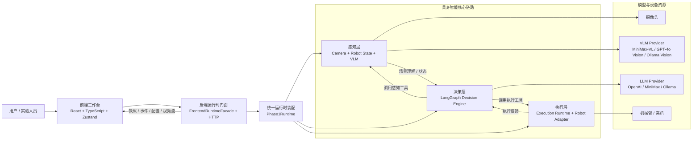

---

## 2. 三层解耦与统一装配关系图

建议放置章节：第 3 章 系统总体架构设计

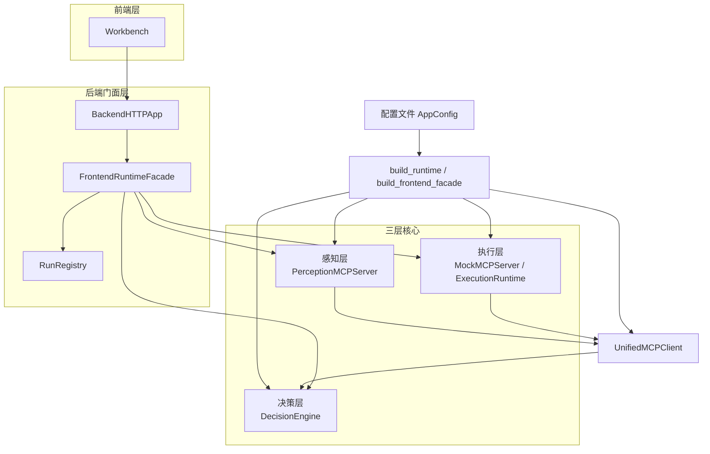

---

## 3. 前后端运行时通信图

建议放置章节：第 7 章 前端工作台设计与实现

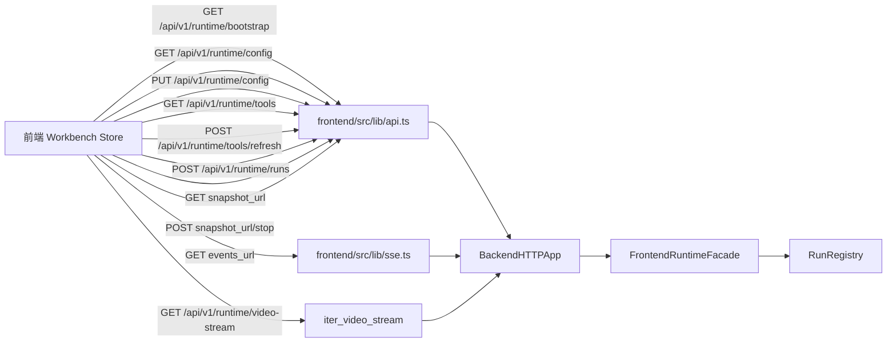

---

## 4. `run_id` 生命周期时序图

建议放置章节：第 7 章 前后端通信机制

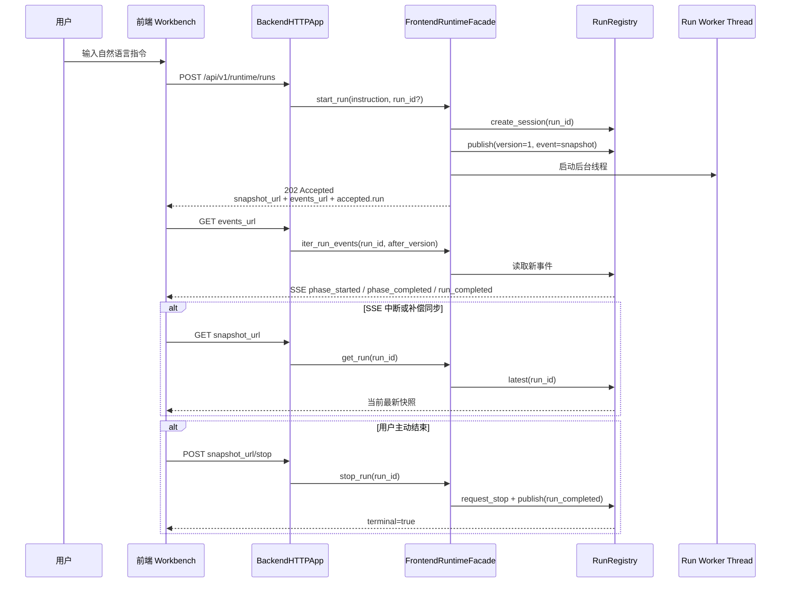

---

## 5. 决策层 LangGraph 状态流图

建议放置章节：第 5 章 决策层 Agent 设计与实现

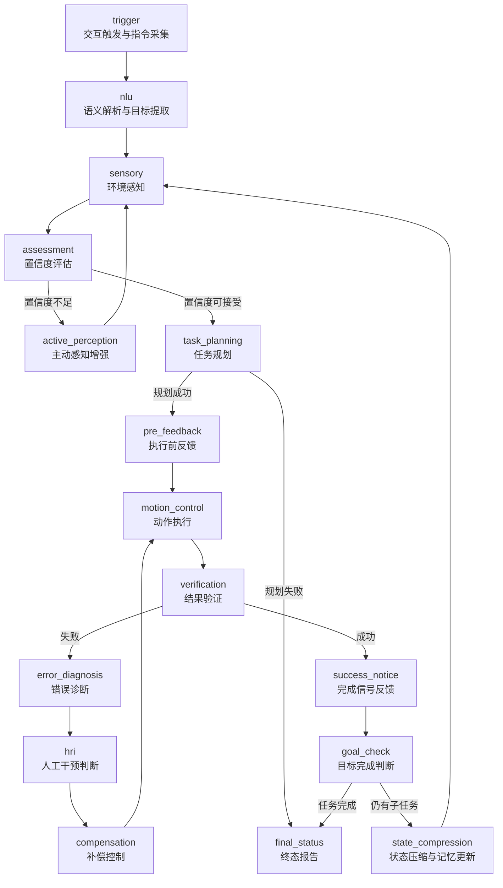

---

## 6. 感知-决策-执行工具调用图

建议放置章节：第 3 章 架构设计 或 第 5 章 决策层实现

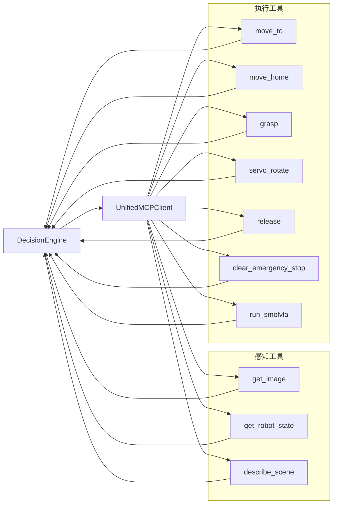

---

## 7. 执行层安全闭环图

建议放置章节：第 6 章 动作执行层设计与实现

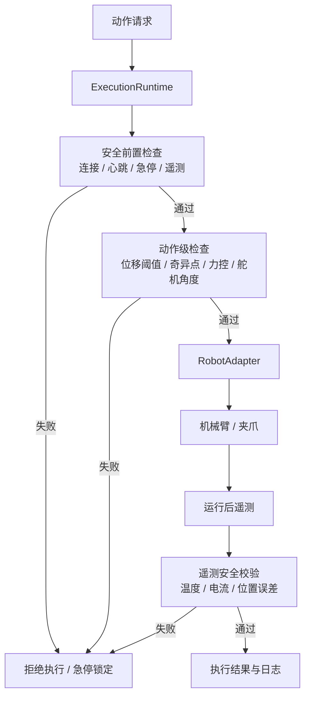

---

## 8. 前端工作台状态管理与接口接线图

建议放置章节：第 7 章 前端工作台设计与实现

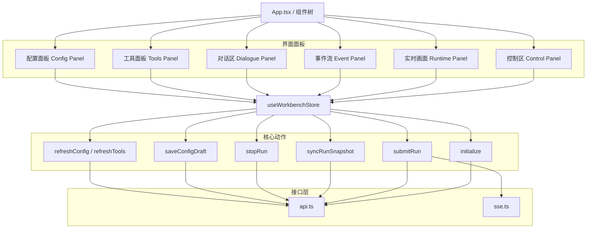

---

## 9. 感知层单层架构图

建议放置章节：第 4 章 环境感知层设计

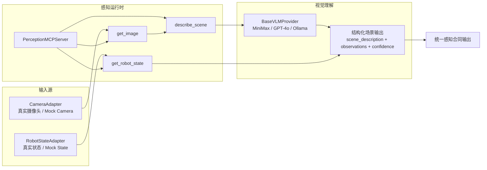

---

## 10. 决策层单层架构图

建议放置章节：第 5 章 决策层 Agent 设计与实现

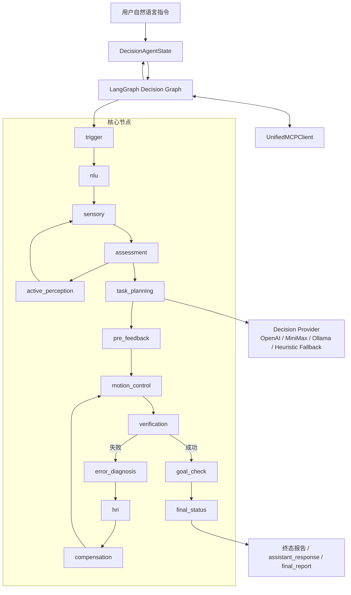

---

## 11. 执行层单层架构图

建议放置章节：第 6 章 动作执行层设计与实现

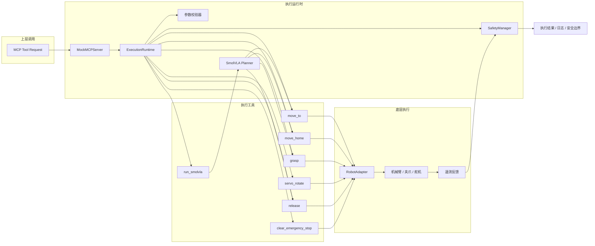

---

## 12. 汉诺塔任务 Skill 流程图

建议放置章节：任务技能扩展小节 / 附录

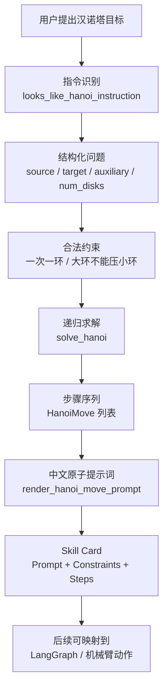

---

## 使用建议

- 第 3 章优先放图 1、图 2、图 6。
- 第 4 章优先放图 9。
- 第 5 章优先放图 5、图 10。
- 第 6 章优先放图 7、图 11。
- 第 7 章优先放图 3、图 4、图 8。
- 任务技能扩展或附录可放图 12。
- 如果答辩页数有限，保留图 1、图 4、图 5、图 7 四张即可。
